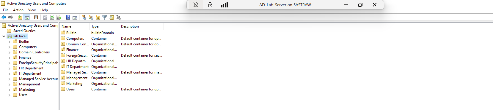
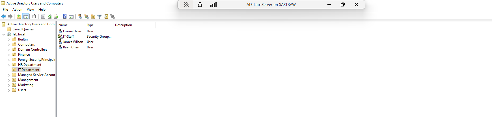
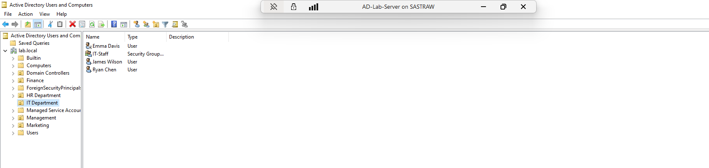
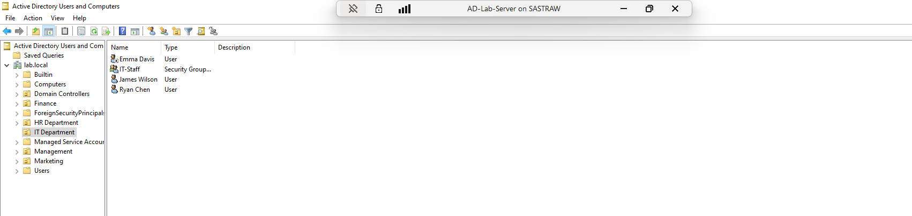
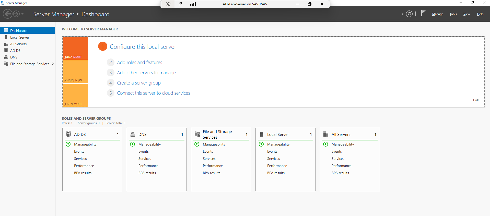

# Active Directory Home Lab — Windows Server 2022

## Overview
A home lab project simulating a real enterprise IT environment using Windows Server 2022 and Active Directory Domain Services (AD DS). Built to develop practical helpdesk and IT support skills including user account management, organisational structure, and common L1/L2 support tasks.

## Tools & Technologies
- Windows Server 2022 (Evaluation)
- Hyper-V (Windows 11 Pro)
- Active Directory Domain Services (AD DS)
- DNS Server
- Active Directory Users and Computers (ADUC)

## Environment Setup
- Deployed Windows Server 2022 as a virtual machine using Hyper-V
- Promoted the server to a Domain Controller
- Created a new Active Directory forest with domain: `lab.local`
- Configured DNS to support the domain

## What I Built

### Organisational Units (OUs)
Created 5 OUs to simulate a real company structure:
- IT Department
- HR Department
- Finance
- Management
- Marketing

### User Accounts
Created users across all departments with proper naming conventions and login credentials (e.g. `jsmith`, `eclark`, `lchen`)

### Security Group
- Created `IT-Staff` security group under IT Department
- Added all IT Department users as members to simulate role-based access control

## Helpdesk Tasks Performed

| Task | Description |
|------|-------------|
| User creation | Created user accounts across all 5 departments |
| Group management | Created security group and assigned members |
| Account disable | Disabled a user account to simulate employee offboarding |
| Password reset | Reset a user password to simulate a helpdesk ticket |

### 1. Full AD Structure — lab.local domain with all OUs

### 2. IT Department — Users and Security Group

### 3. Disabled User Account

### 4. IT-Staff Group Members

### 5. Server Manager Dashboard — AD DS and DNS running

## What I Learned
- How to deploy and configure Windows Server 2022 in a virtualised environment
- How Active Directory structures work — forests, domains, OUs, and users
- How to perform common L1 helpdesk tasks: user creation, password resets, account disabling
- How security groups work for role-based access management
- The importance of organised OU structures in real enterprise environments
